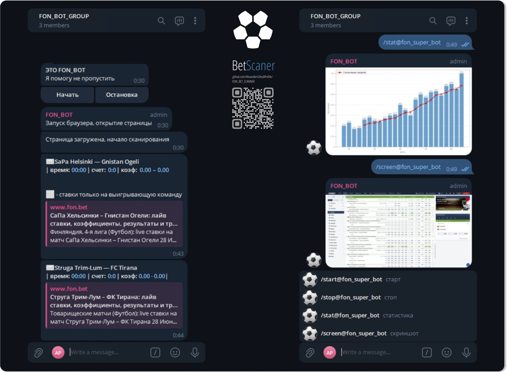

# FON BET SCANNER: Advanced Betting Alert System
- A convenient parser for tracking events on a dynamic website, bypassing automation detection, working without opening a window, and with notifications in Telegram.

[English](./README_en.md) | [Русский](./README.md)

<p align="center">
 
</p>

## Usage
The application runs in a container without opening a window, with an executable file for convenient work without an IDE (pycharm) and auto-start Docker.
> - The script simulates user behavior, scrolls the page, and collects necessary data.
> - Control the start and stop from the chat, calculate bets, and place them based on the collected data.
> - Automates login by loading login data from cookies.
> - Commands screen/stat - screenshot of the current screen/visualization of account statistics are sent to the chat.
> - Ad blocking - the script automatically closes pop-ups and ads.

<p align="center">
   
</p>

## Applied Technologies
The script uses the following technologies and libraries:
> - **[xvfb](https://www.x.org/releases/X11R7.6/doc/man/man1/Xvfb.1.xhtml)**: Virtual X server for headless browser.
> - **[fluxbox](https://fluxbox.org/)**: Window manager for managing virtual windows.
> - **[x11vnc](https://www.karlrunge.com/x11vnc/)**: VNC server for remote management of virtual windows.
> - **[openCV](https://opencv.org/)**: Image processing library.
> - **[selenium + uc](https://www.selenium.dev/)**: Tool for web browser automation.
> - **[postgreSQL](https://www.postgresql.org)**: Database management system.
> - **[requests](https://docs.python-requests.org/en/latest/)**: Library for HTTP requests.
> - **[docker](https://www.docker.com/)**: Application containerization platform.
> - **[telebot](https://pypi.org/project/pyTelegramBotAPI/)**: Library for working with the Telegram API.
> - **[pandas](https://pandas.pydata.org/)**: Data manipulation library.
> - **[time](https://docs.python.org/3/library/time.html)**: Time library.
> - **[schedule](https://schedule.readthedocs.io/en/stable/)**: Task scheduling library.

## Project Organization

1. **fon_bet_scanner**: Main project directory and application settings.

    - `Dockerfile`: Docker settings.
    - `README.md`: Project description file.
    - `docker-compose.yml`: Configuration for launching.
    - `docker_activate.bat`: Script to activate Docker on Windows.
    - `entrypoint.sh`: Script to start the container.
    - `mount`: Directory with main scripts.
        - `bot_telegram.py`: Script for interacting with Telegram.
        - `cookies.json`: File with login cookies.
        - `main.py`: Main script file.
        - `run_background.py`: Script for background tasks.
        - `utils_db.py`: Database functions.
        - `utils_img.py`: Image processing functions.
        - `utils_navigation.py`: Website navigation functions.
        - `utils_processsing.py`: Website element processing functions.
        - `utils_telegram.py`: Telegram functions.
    - `requirements.txt`: Project dependencies list.

- #### Create a [.env](https://www.google.com/search?client=opera-gx&q=.env&sourceid=opera&ie=UTF-8&oe=UTF-8) file in the mount folder to configure environment variables:
```dotenv
# Sample required .env file
TELEGRAM_TOKEN=        # telegram_bot_token
CHAT_ID=               # telegram_chat_id
MIN_BET=               # minimum_bet_coefficient
GAME_MINUTES=          # game_time
MAX_BET=               # maximum_bet_coefficient
SCORE=                 # score_list_type
```
- #### Add a [cookies.json](https://en.wikipedia.org/wiki/HTTP_cookie) file to the mount folder:
```dotenv
# Perform manual login to the site and execute the script
import time
import json
cookies = driver.get_cookies()
with open('cookies.json', 'w') as file:
    json.dump(cookies, file)
```

 ## Getting Started
- **You will need a configured [Telegram]() account to receive notifications and [Docker]() to run the container.**

```bash
# Clone the repository
git clone https://github.com/YourGithubProfile/FON_BET_SCANNER.git

# Windows. Open the script
docker_activate.bat
```